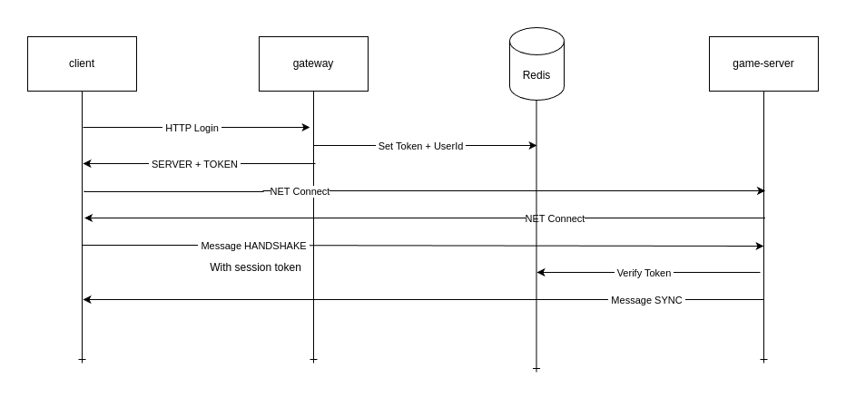

# MMO PoC

This project attempts to be a PoC/research tool to fiddle and understand MMO architecture and implementation and to be a good excuse to try C++20 (If I ever configure the f** g++ settings for Github Codespaces...).

### THE FUTURE...

What I expect from this project? absolutely nothing...

I just want to learn more and apply some hardcore c++ shennanigans for fun and hopefully to impress girls.

Any relevant stuff I learn might or might not end being a post in my blog... Who knows https://prdeving.wordpress.com

### Functionalities

NONE...

for now (29th Dec 2024) I'm mostly focused in idiomatic abstractions, multithreading and networking in C++.
In terms of functionallities, the project implements a simple handshake mechanism that allows clients to login in game servers, the first step towards WoW2.

### Pieces

- redis (docker-compose.yml)

Redis is used as a distributed session persistence layer so game servers can validate users.

- game-server (C++)

It's the main game piece, gonna handle the game flow and it's the connection point for the clients.
In the future I plan to introduce world-servers to implement seamless zone swapping but that gonna have to wait.

- gateway-server (NodeJS)

For now, a simple implementation to mock the session auth service, it's going to handle logins and game-server balancing until world servers are implemented

- client (C++)

Simple game client that connects to the game server

### Running the project

There's no simple way to run everything at once yet.

**Build the project**

```
mkdir build
cd build
cmake ..
make
```

**Install NPM dependencies for the gateway sevice** (it's not connected yet tho)

```
cd gateway-server
npm i
```

Run everything, bear in mind the order!!

**Run redis**

```
docker compose up redis
```
**Run the gateway** (not needed for now)

```
cd gateway-server
npm run start:dev
```

**Run the other stuff**
```
./build/bin/game-server
./build/bin/client
```

you should have an output like this, showing the login and handshake procedure between client and game server:

```
/workspaces/MMO/build (main) $ ./bin/game-server 
ENet: Initialized.
Hiredis: Connected to Redis server
ENet: Host created.
Client 1657812670 connected.
Hiredis: GET k: 123456789, v: testuserid
Client testuserid logged in with handle 1657812670
ENet: Deinitialized.
Hiredis: Disconnected from Redis server
```

```
/workspaces/MMO/build (main) $ ./bin/client 
ENet: Initialized.
ENet: Connected to peer.
Connected.
Received Hello client! from server
Disonnected.
ENet: Deinitialized.
```

### Directories

**Misc**
+ doc (documentation and diagrams gonna be here)

**Tech stuff**
+ external (third party libs like sqlite or hiredis)
+ include (comon hpp for other packages)
+ libs (custom libs like networking or persistence abstractions)

**Applications**
+ game-server (game server app)
+ gateway-server (gateway app)
+ client (client app)


### Auth Flow

In terms of auth flows, MMOs typically follow an authoritative gateway architecture.

1- The client connects to the gateway and performs a login.
2- The gateway generates a session token that is persisted temporarely in a distributed persistence layer
3- The gateway returns the token to the client
4- The client connects to the game server using the token provided
5- The game server checks against the persistence layer if the token is valid


In this project the gateway is written as a simple nodeJS HTTP server with a single `/login` endpoint and a single hardcoded user with the following credentials:

```
{
    "username": "user",
    "password": "password"
}
```

The login endpoint stores a session in redis for the game server to auth the connection and returns the session token and the game server address and port to the client so it can connect:

```
{
    "session": "fb7af8663063f55cc6f37643fdbc35980595ebe4383695a085645f7631396eaf",
    "host": "127.0.0.1",
    "port": 6379
}
```


